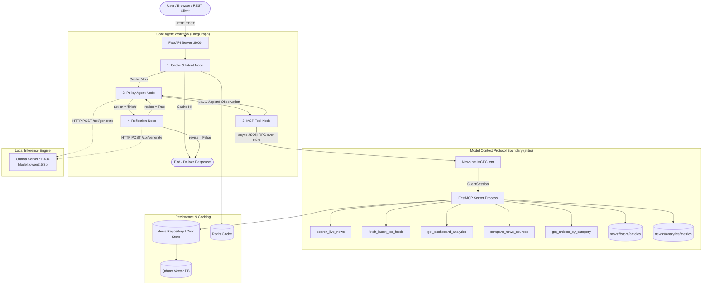

# NewsIntel AI – Multi-Agent Enterprise News Intelligence Platform

NewsIntel AI is a production-grade, Level 2 (L2) tool-using multi-agent enterprise platform for aggregating, analyzing, and questioning real-time news across major global and national media outlets. 

Powered by a **Model Context Protocol (MCP)** server-client architecture over standard I/O (`stdio` JSON-RPC) and orchestrated via **LangGraph**, it enables semantic news retrieval, multi-source editorial comparison, and factual executive summarization with local LLM integration and observation-grounded reflection.

---

## 📚 Project Documentation Suite

- **[Software Requirements Specification (SRS)](docs/SRS.md)**: Functional, non-functional, and compliance requirements.
- **[Technical Reference Specification (TRS)](docs/TRS.md)**: Deep architectural design, MCP protocol specifications, LangGraph state machine transitions, and evaluation formulas.

---

## 🏗️ Architecture Overview



---

## 🛠️ Technology Stack

* **Backend API**: FastAPI, Python 3.11+, Uvicorn, Pydantic v2
* **Frontend UI**: React 18, TypeScript, Vite, Tailwind CSS, Lucide Icons
* **Multi-Agent Orchestration**: LangGraph, LangChain
* **AI & Embedding Models**: Ollama (`qwen2.5:3b` local model), HuggingFace Transformers
* **API Protocol Layer**: Model Context Protocol (MCP) FastMCP Server & stdio `ClientSession`
* **Databases & Cache**:
  * **MongoDB** (Stored article metadata)
  * **Qdrant** (Vector store for search embeddings)
  * **Redis** (Response caching & telemetry counters)
  * **Disk File System** (JSON store fallback for standalone zero-dependency mode)

---

## 🤖 MCP Server & Client Primitives

The FastMCP server (`backend/app/mcp_server.py`) runs as an isolated subprocess and is managed via `NewsIntelMCPClient` (`backend/app/mcp_client.py`) over `stdio` transport.

### 5 Registered MCP Tools
1. **`search_live_news`**: Search indexed live news articles, location trends, or topic news (`query`, `category`, `source`, `limit: 1..50`).
2. **`fetch_latest_rss_feeds`**: Trigger live RSS news ingestion from configured media outlets.
3. **`get_dashboard_analytics`**: Retrieve global platform statistics, category counts, and ingestion metrics.
4. **`compare_news_sources`**: Compare coverage, exclusive topics, and shared stories between two media outlets (`source1`, `source2`).
5. **`get_articles_by_category`**: Retrieve live news articles matching a specific category (`category`, `limit: 1..50`).

### 2 Exposed MCP Resources
1. **`news://store/articles`**: Access the complete stored articles dataset.
2. **`news://analytics/metrics`**: Access platform analytics, entity distribution, and duplicate stats.

---

## 🚀 Quick Start Guide

### Prerequisites
* **Python** (v3.11 or higher)
* **Node.js** (v18 or higher)
* **Ollama** (Optional for local LLM inference: `ollama run qwen2.5:3b`)

### 1. Backend Setup
```powershell
cd backend

# Create & activate virtual environment
python -m venv venv
.\venv\Scripts\activate

# Install dependencies
pip install -r requirements.txt

# Start the backend server
uvicorn app.main:app --host 127.0.0.1 --port 8000 --reload
```
*Backend API will be live at `http://127.0.0.1:8000` with Swagger docs at `http://127.0.0.1:8000/docs`.*

### 2. Frontend Setup
```powershell
cd frontend
npm install
npm run dev
```
*Frontend UI will be live at `http://localhost:5173`.*

---

## 🧪 Testing & Quality Assurance

Offline tests have zero external network or database requirements.

> **Note:** CI/CD workflows are intentionally not included in this repository — the project is in an active local testing phase. Run tests locally using the commands below.

```powershell
cd backend

# 1. Run standard offline test suite (import smoke + unit + integration, no live services)
.\venv\Scripts\python.exe -m pytest -q -p no:cacheprovider --basetemp C:\tmp\agent-verify

# 2. Run real MCP stdio ClientSession integration test (independently verified)
.\venv\Scripts\python.exe -m pytest tests/test_mcp_real_session.py -v

# 3. Run live trace script (Requires Ollama: `ollama run qwen2.5:3b`)
.\venv\Scripts\python.exe scripts/run_live_trace.py

# 4. Verify a locally-generated live agent trace
.\venv\Scripts\python.exe scripts/verify_live_trace.py
```

### Trace Artifacts & Verification

A sanitized live agent execution trace is committed to verify full protocol compliance:

- **`backend/tests/live_agent_trace.txt`**: Proves real `stdio` MCP transport (`ClientSession`), dynamic discovery of all 5 tools, LLM policy action decisions, tool observations, and reflection validation across 3 live ReAcT iterations.
- **Run Verification**: `python backend/scripts/verify_live_trace.py` validates the trace format and assertions.
- **Regenerate Fresh Trace**: `python backend/scripts/run_live_trace.py` (requires local Ollama `qwen2.5:3b` + active MCP session).

---

## 📊 Live Evaluation Benchmark

Trigger a dynamic evaluation run across labeled ground-truth queries (`backend/app/data/eval_dataset.json`):

```bash
# Trigger benchmark via REST API
curl -X POST http://127.0.0.1:8000/api/analytics/evaluate
```

* **Evaluation Store**: [`backend/app/data/evaluation_runs_store.json`](backend/app/data/evaluation_runs_store.json)
* **Real Latency**: High-precision monotonic timer elapsed time (`time.perf_counter()`).
* **Unclamped Routing Accuracy**: Calculated strictly against ground-truth expected tools.
