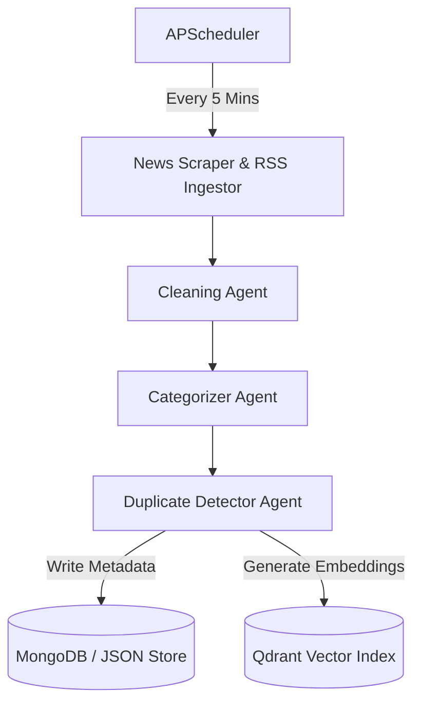
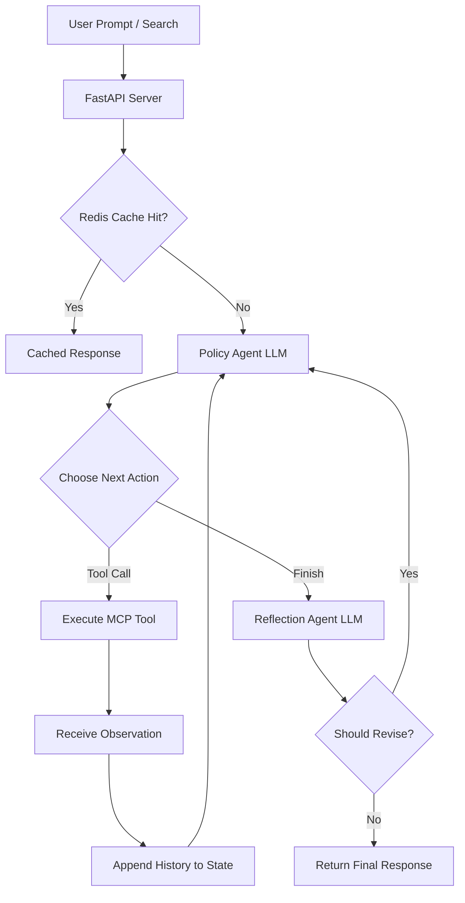

# NewsIntel AI – Multi-Agent Enterprise News Intelligence Platform

NewsIntel AI is a robust, multi-agent enterprise platform for aggregating, analyzing, and questioning real-time news from various top-tier media outlets. Powered by a **Model Context Protocol (MCP)** server-client architecture and orchestrated using **LangGraph**, it enables semantic news retrieval, comparison, and dynamic summarization with local LLM integration.

---

## 🏗️ Architecture & How It Works

The platform operates through two main pipeline flows:

### 1. Ingestion & Enrichment Pipeline (Background Worker)
A background scheduler periodically polls RSS feeds from multiple media outlets, cleanses the articles, categorizes them, and indexes them into database repositories.



### 2. User Query & RAG Pipeline (L2 LangGraph Agentic Loop)
User queries are processed through an iterative Decide → Act → Observe loop guided by a Policy Agent, validated by a Reflection Agent, and benchmarked by real-time evaluation metrics.



---

## 🛠️ Technology Stack

* **Backend API**: FastAPI, Python 3.11, Uvicorn
* **Frontend UI**: React, TypeScript, Vite, Tailwind CSS, Lucide Icons
* **Multi-Agent Orchestration**: LangGraph, LangChain
* **AI & Embedding Models**: Ollama (Qwen2.5 local model), HuggingFace (Transformers)
* **API Protocol Layer**: Model Context Protocol (MCP) Server & Client (via `mcp` SDK)
* **Databases (Multi-Tier)**:
  * **MongoDB** (Stored article metadata)
  * **Qdrant** (Vector store for search embeddings)
  * **Redis** (Caching responses)
  * **Disk File System** (JSON store fallback for lightweight standalone mode)

---

## 🚀 Standalone Local Setup Guide (Without Docker)

You can run the entire frontend and backend directly on your host machine. The backend automatically falls back to in-memory/JSON disk-store modes if MongoDB, Redis, or Qdrant are not running locally.

### Prerequisites
* **Node.js** (v20 or higher)
* **Python** (v3.11 or higher)
* **Ollama** (Running locally with `qwen2.5:3b` pulled: `ollama run qwen2.5:3b`)

### 1. Set Up and Run the Backend
1. Open a terminal and navigate to the backend folder:
   ```bash
   cd backend
   ```
2. Create and activate a Python virtual environment:
   ```bash
   # Windows
   python -m venv venv
   .\venv\Scripts\activate

   # Linux/macOS
   python3 -m venv venv
   source venv/bin/activate
   ```
3. Install dependencies:
   ```bash
   pip install -r requirements.txt
   ```
4. Start the backend FastAPI server:
   ```bash
   python -m uvicorn app.main:app --host 127.0.0.1 --port 8000
   ```
   *The backend will be live at `http://127.0.0.1:8000`.*

### 2. Set Up and Run the Frontend
1. Open a new terminal and navigate to the frontend folder:
   ```bash
   cd frontend
   ```
2. Install npm dependencies:
   ```bash
   npm install
   ```
3. Start the Vite development server:
   ```bash
   npm run dev
   ```
   *The frontend will be live at `http://localhost:5173`.*


---

## 🤖 MCP Server Primitives (Available Tools & Resources)

The backend implements the Model Context Protocol (MCP) server that exposes the following:

### Registered Tools
* `search_live_news`: Search indexed live news articles or retrieve dynamically.
* `fetch_latest_rss_feeds`: Manually trigger live news ingestion.
* `get_dashboard_analytics`: Retrieve platform metrics and trending topics.
* `compare_news_sources`: Compare coverage between two media outlets.
* `get_articles_by_category`: Retrieve articles matching a specific category.

### Exposed Resources
* `news://store/articles`: Retrieve all active stored news articles.
* `news://analytics/metrics`: Access platform analytics and entity distribution metrics.

---

## ⚡ Core Implementations & Benchmarks

The platform incorporates 4 key architectural features:

1. **Genuine Multi-Step Agentic Loop (`main_workflow.py`):**
   - Implements an iterative `Decide → Act → Observe → Reflect` LangGraph state machine.
   - Allows up to `MAX_ITERATIONS = 5` sequential tool invocations (e.g. `search_live_news` followed by `get_dashboard_analytics`) before finalizing responses.

2. **Ground-Truth Routing Accuracy Evaluation (`evaluator.py` & `routing_dataset.json`):**
   - Replaced naive keyword matching with a ground-truth benchmark dataset (`routing_dataset.json`).
   - Evaluates LLM policy routing decisions against 10 explicit `{query, expected_tool}` pairs.

3. **Dynamic Evaluation Metrics Engine (`evaluator.py`):**
   - Replaced all hardcoded metric sentinels (`categorization_f1 = 0.85`, `deduplication_recall = 1.0`).
   - Measures real-time macro/micro F1 categorization performance on [`categorization_eval_dataset.json`](file:///c:/Users/AishwaryaK/Desktop/agent/backend/app/utils/categorization_eval_dataset.json) and deduplication recall on [`deduplication_eval_dataset.json`](file:///c:/Users/AishwaryaK/Desktop/agent/backend/app/utils/deduplication_eval_dataset.json).

4. **Production-Grade Redis Caching (`redis_cache.py`):**
   - Integrates SHA-256 query digest hashing (`newsintel:query:<sha256>`) with configurable TTL (`CACHE_TTL_SECONDS`).
   - Tracks dynamic hit/miss metrics in real time with fast offline connection fallbacks (`socket_connect_timeout=0.2s`).

