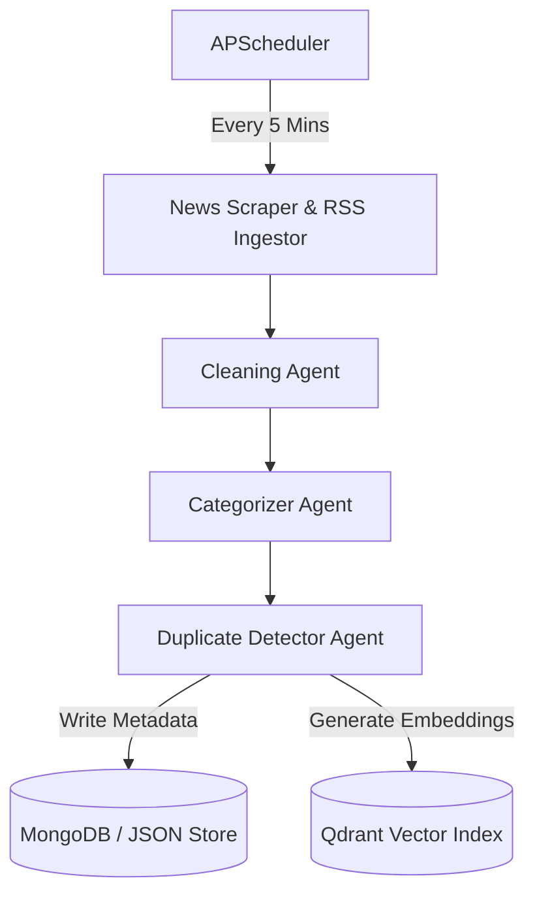
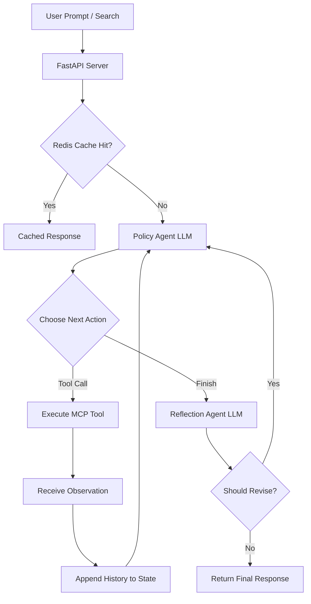

# NewsIntel AI – Multi-Agent Enterprise News Intelligence Platform

NewsIntel AI is a robust, multi-agent enterprise platform for aggregating, analyzing, and questioning real-time news from various top-tier media outlets. Powered by a **Model Context Protocol (MCP)** server-client architecture and orchestrated using **LangGraph**, it enables semantic news retrieval, comparison, and dynamic summarization with local LLM integration.

---

## 🏗️ Architecture & How It Works

The platform operates through two main pipeline flows:

### 1. Ingestion & Enrichment Pipeline (Background Worker)
A background scheduler periodically polls RSS feeds from multiple media outlets, cleanses the articles, categorizes them, and indexes them into database repositories.



### 2. User Query & RAG Pipeline (L2 LangGraph Agentic Loop)
User queries are processed through an iterative Decide → Act → Observe loop guided by a Policy Agent, validated by a Reflection Agent, and benchmarked by real-time evaluation metrics.



---

## 🛠️ Technology Stack

* **Backend API**: FastAPI, Python 3.11+, Uvicorn
* **Frontend UI**: React, TypeScript, Vite, Tailwind CSS, Lucide Icons
* **Multi-Agent Orchestration**: LangGraph, LangChain
* **AI & Embedding Models**: Ollama (`qwen2.5:3b` local model), HuggingFace Transformers
* **API Protocol Layer**: Model Context Protocol (MCP) Server & Client (via `mcp` SDK)
* **Databases (Multi-Tier)**:
  * **MongoDB** (Stored article metadata)
  * **Qdrant** (Vector store for search embeddings)
  * **Redis** (Caching responses)
  * **Disk File System** (JSON store fallback for lightweight standalone mode)

---

## 🚀 Standalone Local Setup Guide (Without Docker)

You can run the entire frontend and backend directly on your host machine. The backend automatically falls back to in-memory/JSON disk-store modes if MongoDB, Redis, or Qdrant are not running locally.

### Prerequisites
* **Node.js** (v20 or higher)
* **Python** (v3.11 or higher)
* **Ollama** (Optional for live LLM routing & reflection: `ollama run qwen2.5:3b`)

### 1. Set Up and Run the Backend
1. Open a terminal and navigate to the backend folder:
   ```bash
   cd backend
   ```
2. Create and activate a Python virtual environment:
   ```bash
   # Windows
   python -m venv venv
   .\venv\Scripts\activate

   # Linux/macOS
   python3 -m venv venv
   source venv/bin/activate
   ```
3. Install dependencies:
   ```bash
   pip install -r requirements.txt
   ```
4. Start the backend FastAPI server:
   ```bash
   python -m uvicorn app.main:app --host 127.0.0.1 --port 8000
   ```
   *The backend will be live at `http://127.0.0.1:8000`.*

### 2. Set Up and Run the Frontend
1. Open a new terminal and navigate to the frontend folder:
   ```bash
   cd frontend
   ```
2. Install npm dependencies:
   ```bash
   npm install
   ```
3. Start the Vite development server:
   ```bash
   npm run dev
   ```
   *The frontend will be live at `http://localhost:5173`.*

---

## 🧪 Testing & Quality Assurance

### Exact Test Commands
To run the standard offline test suite (excluding live external service dependencies), navigate to the `backend/` directory and execute:

```bash
# Standard Offline Suite (Runs Unit + Deterministic Integration Tests)
python -m pytest -q
```

To run specific test categories independently:

```bash
# Category 1: Unit Tests Only (Mocks/Fakes, Zero External Services)
python -m pytest -m unit -q

# Category 2: Deterministic Integration Tests Only (Fake LLM/MCP boundaries)
python -m pytest -m integration -q

# Category 3: Optional Live Tests (Requires Running Ollama on http://localhost:11434)
python -m pytest -m live -q
```

*(Current Standard Test Suite Status: **67 / 67 Passed**, Live Tests: **1 Marked Live**)*

### Test Dependencies
The test suite requires the following Python dependencies (installed via `requirements.txt`):
* `pytest` & `pytest-asyncio`
* `fastapi` & `starlette`
* `langgraph` & `langchain`
* `pydantic` & `httpx`
* `requests`

### Test Categorization Architecture
1. **Category 1 — Unit Tests (`@pytest.mark.unit`)**: Test isolated components, utility functions, schemas, text cleaners, Policy action parsers, and caching logic without external services or network calls (`tests/test_api.py`, `tests/test_policy_action_validation.py`, `tests/test_cache.py`).
2. **Category 2 — Deterministic Integration Tests (`@pytest.mark.integration`)**: Prove Policy Agent decisions, multi-step loops, observation history propagation, finish actions, Reflection Agent validation, revision loops, and evaluation metrics using deterministic LLM/MCP mock boundaries (`tests/test_agentic_loop.py`, `tests/test_evaluation.py`, `tests/test_latency_cache.py`, `tests/test_briefing_pipeline.py`, `tests/test_reflection_agent.py`).
3. **Category 3 — Optional Live Tests (`@pytest.mark.live`)**: Test end-to-end LLM inference against an actual running Ollama server (`http://localhost:11434`). Configured in `pyproject.toml` (`addopts = "-m \"not live\""`) so normal test runs do not require external services (`test_live_ollama_integration` in `tests/test_agentic_loop.py`).

---

## ⚡ Core Architectural Features & Benchmarks

### 1. Genuine Multi-Step Agentic Loop (`backend/app/workflows/main_workflow.py`)
* Implements an iterative `Decide → Act → Observe → Reflect` LangGraph state machine.
* Supports up to `MAX_ITERATIONS = 5` sequential tool invocations (e.g. `search_live_news` followed by `get_dashboard_analytics`) before finalizing responses.
* **Policy Agent Trace & Evidence**: Multi-tool execution traces record exact step arguments, execution timestamps, and tool observations into `AgentState["observations"]`.

### 2. Ground-Truth Routing Accuracy Benchmark (`backend/app/utils/evaluator.py` & `backend/app/utils/routing_dataset.json`)
* Evaluates Policy Agent decisions against explicitly labeled `{query, expected_tool}` pairs in `routing_dataset.json`.
* **Zero Keyword Inference**: Expected tools are read exclusively from ground-truth data, and actual tools are obtained strictly by executing `PolicyAgent.decide_action()`.

### 3. Reflection Agent & Conservative Fallback (`backend/app/agents/reflection_agent.py`)
* **LLM Reflection**: Compares generated summaries against retrieved observation tokens to classify claims (`VERIFIED` vs `REVISED`).
* **Deterministic Fallback**: If Ollama is offline or times out, the Reflection Agent executes `_extract_observation_tokens()` to verify grounding. Unconfirmed claims are flagged as `UNVERIFIED` in the response header to ensure transparency.

### 4. Real Latency & Redis Cache-Hit Measurement (`backend/app/workflows/main_workflow.py` & `backend/app/utils/redis_cache.py`)
* **Real Latency**: Captured using high-precision `time.perf_counter()` starting at request entry and ending upon final state generation.
* **Redis Cache Hit/Miss**: Uses SHA-256 query digest keys (`newsintel:query:<sha256>`). On a hit, returns cached response with `cache_hit: True` and zero latency overhead.

---

## 📊 Evaluation Metrics Glossary

Each metric reported by `evaluate_execution()` is defined as follows:

| Metric | What It Measures | How It Is Calculated | Data Used |
| :--- | :--- | :--- | :--- |
| **Precision@5** | Quality of top 5 RAG search results | `relevant_docs_in_top_5 / min(5, total_docs)` | Keyword overlap between query and retrieved document titles/content |
| **MRR@10** | Reciprocal rank of the first relevant result in top 10 | `1 / first_relevant_rank` (or `0.0` if none) | Document position in top 10 search results |
| **Faithfulness** | Proportion of generated summary claims supported by sources | `matching_summary_tokens / total_summary_tokens` | Token overlap between generated answer and retrieved source text |
| **Routing Accuracy** | Policy Agent tool selection accuracy | `correct_selections / evaluated_queries` | Policy Agent output vs ground-truth labels in `routing_dataset.json` |
| **Categorization F1** | Categorization accuracy across news classes | Macro F1 score across all categories | CategorizationAgent predictions vs labels in `categorization_eval_dataset.json` |
| **Deduplication Recall** | Duplicate article detection performance | `true_positives / (true_positives + false_negatives)` | DuplicateDetectorAgent output vs pairs in `deduplication_eval_dataset.json` |

---

## 🤖 MCP Server Primitives (Available Tools & Resources)

The backend implements the Model Context Protocol (MCP) server that exposes the following:

### Registered Tools
* `search_live_news`: Search indexed live news articles or retrieve dynamically.
* `fetch_latest_rss_feeds`: Manually trigger live news ingestion.
* `get_dashboard_analytics`: Retrieve platform metrics and trending topics.
* `compare_news_sources`: Compare coverage between two media outlets.
* `get_articles_by_category`: Retrieve articles matching a specific category.

### Exposed Resources
* `news://store/articles`: Retrieve all active stored news articles.
* `news://analytics/metrics`: Access platform analytics and entity distribution metrics.
