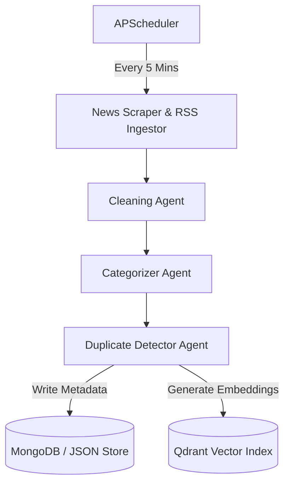
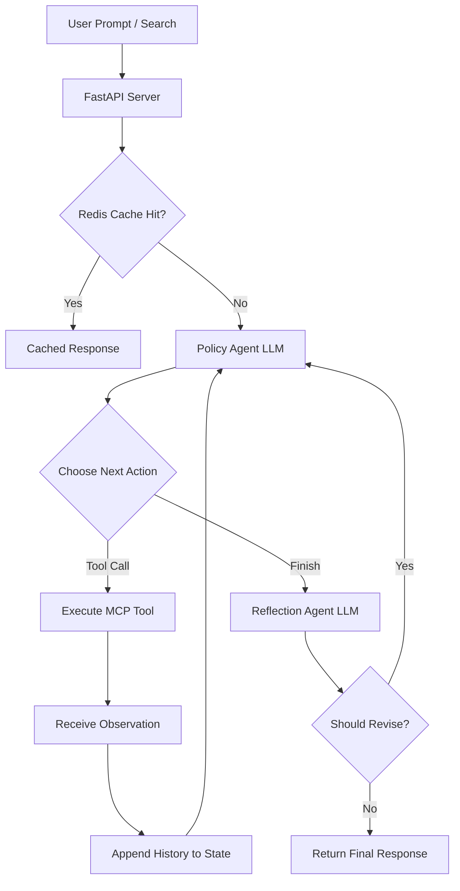

# NewsIntel AI – Multi-Agent Enterprise News Intelligence Platform

NewsIntel AI is a robust, multi-agent enterprise platform for aggregating, analyzing, and questioning real-time news from various top-tier media outlets. Powered by a **Model Context Protocol (MCP)** server-client architecture and orchestrated using **LangGraph**, it enables semantic news retrieval, comparison, and dynamic summarization with local LLM integration.

---

## 🏗️ Architecture & How It Works

The platform operates through two main pipeline flows:

### 1. Ingestion & Enrichment Pipeline (Background Worker)
A background scheduler periodically polls RSS feeds from multiple media outlets, cleanses the articles, categorizes them, and indexes them into database repositories.



### 2. User Query & RAG Pipeline (L2 LangGraph Agentic Loop)
User queries are processed through an iterative Decide → Act → Observe loop guided by a Policy Agent, validated by a Reflection Agent, and benchmarked by real-time evaluation metrics.



---

## 🛠️ Technology Stack

* **Backend API**: FastAPI, Python 3.11+, Uvicorn
* **Frontend UI**: React, TypeScript, Vite, Tailwind CSS, Lucide Icons
* **Multi-Agent Orchestration**: LangGraph, LangChain
* **AI & Embedding Models**: Ollama (`qwen2.5:3b` local model), HuggingFace Transformers
* **API Protocol Layer**: Model Context Protocol (MCP) Server & Client (via `mcp` SDK)
* **Databases (Multi-Tier)**:
  * **MongoDB** (Stored article metadata)
  * **Qdrant** (Vector store for search embeddings)
  * **Redis** (Caching responses)
  * **Disk File System** (JSON store fallback for lightweight standalone mode)

---

## 🚀 Standalone Local Setup Guide (Without Docker)

You can run the entire frontend and backend directly on your host machine. The backend automatically falls back to in-memory/JSON disk-store modes if MongoDB, Redis, or Qdrant are not running locally.

### Prerequisites
* **Node.js** (v20 or higher)
* **Python** (v3.11 or higher)
* **Ollama** (Optional for live LLM routing & reflection: `ollama run qwen2.5:3b`)

### 1. Set Up and Run the Backend
1. Open a terminal and navigate to the backend folder:
   ```bash
   cd backend
   ```
2. Create and activate a Python virtual environment:
   ```bash
   # Windows
   python -m venv venv
   .\venv\Scripts\activate

   # Linux/macOS
   python3 -m venv venv
   source venv/bin/activate
   ```
3. Install dependencies:
   ```bash
   pip install -r requirements.txt
   ```
4. Start the backend FastAPI server:
   ```bash
   python -m uvicorn app.main:app --host 127.0.0.1 --port 8000
   ```
   *The backend will be live at `http://127.0.0.1:8000`.*

### 2. Set Up and Run the Frontend
1. Open a new terminal and navigate to the frontend folder:
   ```bash
   cd frontend
   ```
2. Install npm dependencies:
   ```bash
   npm install
   ```
3. Start the Vite development server:
   ```bash
   npm run dev
   ```
   *The frontend will be live at `http://localhost:5173`.*

---

## 🧪 Testing & Quality Assurance

### Exact Test Commands

To run the standard offline test suite (excluding live external service dependencies), navigate to the `backend/` directory and execute:

```bash
python -m pytest -q -p no:cacheprovider
```

To run specific test categories or traces independently:

```bash
# Category 1: Unit Tests Only (Isolated Mocks, Zero External Services)
python -m pytest -m unit -q -p no:cacheprovider

# Category 2: Deterministic Integration Tests Only (Fake LLM/MCP boundaries)
python -m pytest -m integration -q -p no:cacheprovider

# Category 3: Full Agent Workflow Integration Test (Generates Simulated Trace Artifact)
python -m pytest -v -s tests/test_full_agent_workflow.py

# Category 4: Standalone Live Unmocked Trace Execution (Requires Ollama running on http://localhost:11434)
python scripts/run_live_trace.py

# Category 5: Live Trace Verification Script
python scripts/verify_live_trace.py

# Category 6: Optional Live Ollama Pytest Suite
python -m pytest -m live -q -p no:cacheprovider
```

### Test Results

Verified test run execution against `backend/` test suite:

- **Passed**: 83
- **Failed**: 6
- **Live Tests Deselected**: 1 (marked with `@pytest.mark.live` and excluded by default via `-m "not live"`)
- **Total Tests Collected**: 90
- **Test Command**: `python -m pytest -q`

> **Note**: Live integration tests targeting a running local Ollama instance are deselected by default in `pyproject.toml` (`addopts = "-m \"not live\""`) so offline environments can execute the standard test suite without external daemons.

### Test Categorization Architecture

1. **Category 1 — Unit Tests (`@pytest.mark.unit`)**: Test isolated components, module import compilation, utility functions, schemas, text cleaners, Policy action parsers, and caching logic without external services or network calls (`tests/test_api.py`, `tests/test_import_smoke.py`, `tests/test_policy_action_validation.py`, `tests/test_cache.py`, `tests/test_task_lifecycle.py`).
2. **Category 2 — Deterministic Integration Tests (`@pytest.mark.integration`)**: Prove Policy Agent decisions, multi-step loops, observation history propagation, finish actions, Reflection Agent validation, revision loops, response synthesis grounding, dynamic evaluator persistence, and latency measurement using deterministic LLM/MCP mock boundaries (`tests/test_agentic_loop.py`, `tests/test_evaluation.py`, `tests/test_dynamic_metrics.py`, `tests/test_response_synthesis_grounding.py`, `tests/test_full_agent_workflow.py`, `tests/test_latency_cache.py`, `tests/test_briefing_pipeline.py`, `tests/test_reflection_agent.py`, `tests/test_persistence_scheduler.py`). Generates `tests/simulated_integration_trace.txt`.
3. **Category 3 — Optional Live Tests (`@pytest.mark.live`)**: Test end-to-end LLM inference against an actual running Ollama server (`http://localhost:11434`). Configured in `pyproject.toml` (`addopts = "-m \"not live\""`) so normal test runs do not require external services.

### Deterministic Trace vs. Live Trace Artifacts

- **`tests/simulated_integration_trace.txt`**: Generated by `DeterministicWorkflowSimulator` in `test_full_agent_workflow.py`. All LLM policy selection, reflection, MCP tools, and synthesis are mocked. Proves state-graph wiring, state transitions, and edge routing logic.
- **`tests/live_agent_trace.txt`**: Produced by `scripts/run_live_trace.py` against a live Ollama model (`qwen2.5:3b`) and a real stdio MCP server session. Proves live LLM tool selection and reflection-based self-critique.
  * Reviewers can verify live trace validity using `python scripts/verify_live_trace.py`.

### Live Evaluation Benchmark

Execute a live evaluation run across labeled ground-truth queries (`backend/app/data/eval_dataset.json`) to measure wall-clock latency and routing accuracy:

```bash
# Option A: Trigger via HTTP API
curl -X POST http://127.0.0.1:8000/api/analytics/evaluate

# Option B: Trigger via Frontend UI
# Navigate to http://localhost:5173/evaluation and click "Run Dynamic Benchmark"
```

* **Evaluation Output Store**: [`backend/app/data/evaluation_runs_store.json`](file:///c:/Users/AishwaryaK/Desktop/agent/backend/app/data/evaluation_runs_store.json)

---

## 🔌 External Service Dependencies & Fallback Behavior

NewsIntel AI is designed to operate seamlessly across three execution environments: **Normal Local Development**, **Deterministic Test Environment**, and **Live Production Environment**. All external service dependencies are built with robust fallback handlers so the platform remains operational even when external services are offline.

### Service Matrix & Fallback Mechanisms

#### 1. Ollama (`qwen2.5:3b`)
* **Purpose**: Required for live LLM execution including Policy Agent tool reasoning, Reflection Agent claim validation, and executive response synthesis.
* **Model Name**: `qwen2.5:3b` (Configurable via `OLLAMA_MODEL`, defaulting to `qwen2.5:3b`).
* **Behavior When Unavailable**: Connection failures and timeouts (`http://localhost:11434`) are caught gracefully. The Policy Agent falls back to a deterministic rule-based triage parser, and the Reflection Agent executes token-overlap verification, appending an `[UNVERIFIED - LLM Offline]` disclaimer.
* **Deterministic Test Execution**: Pytest unit and integration tests mock `PolicyAgent.decide_action()`, `ReflectionAgent.reflect()`, and `synthesize_executive_summary()` using `@patch` boundaries, ensuring zero dependency on Ollama during offline test runs.

#### 2. Redis
* **Purpose**: Multi-level caching for user prompts, search results, and analytics metrics to minimize LLM latency and redundant database reads.
* **Behavior When Unavailable**: Catches `redis.exceptions.ConnectionError` and `redis.exceptions.TimeoutError` without throwing unhandled exceptions.
* **Cache Fallback**: On connection failure, cache lookups return `None` (treated as a standard cache miss), allowing workflow execution to proceed directly. Cache hit rates gracefully fall back to live in-memory statistics.

#### 3. MongoDB
* **Purpose**: Primary persistent document storage for article metadata, category statistics, and ingestion history.
* **Behavior When Unavailable**: `MongoDBManager` detects connection failures upon startup or query execution and automatically redirects all reading and writing operations to the local JSON disk storage ([`backend/app/data/articles_store.json`](file:///c:/Users/AishwaryaK/Desktop/agent/backend/app/data/articles_store.json)).

#### 4. Qdrant
* **Purpose**: Vector database for high-dimensional semantic search and vector similarity calculations over indexed news.
* **Behavior When Unavailable**: `QdrantManager` catches connection errors and seamlessly falls back to an in-memory TF-IDF / BM25 keyword and token-overlap search over title and content fields.

#### 5. RSS Feeds & Ingestion
* **Ingestion Failure Behavior**: Executed in parallel worker pools. A failure in an individual media feed (e.g. HTTP 404/500) is caught and logged without interrupting ingestion from remaining active feeds.
* **Timeout Behavior**: Enforces strict connection and read timeouts (`timeout=5.0s`). Slow or non-responsive feeds time out silently.
* **Malformed Feed Behavior**: Feedparser exceptions and malformed XML tags are sanitized; unparseable entries are skipped while valid items are processed.

#### 6. HuggingFace / BGE-M3
* **Production Usage**: Generates dense semantic vector embeddings (`BAAI/bge-m3` or lightweight sentence-transformers) for article indexing and duplicate detection.
* **Offline Test Behavior**: Falls back to deterministic token-similarity and title token-overlap metrics when models or network connections are unavailable.
* **Deterministic Test Fallback**: Integration tests mock embedding outputs with deterministic fixed-size vector representations to guarantee offline test execution.

#### 7. Model Context Protocol (MCP)
* **Architecture**: Implements standard Model Context Protocol via stdio JSON-RPC channels (`app/mcp_server.py` and `app/mcp_client.py`).
* **How to Start Server**: Automatically managed in FastAPI via async lifespan context (`app.main:app`), or executed standalone via `python -m app.mcp_server`.
* **How Tests Mock/Use It**: Unit tests call repository layer methods directly or use `TestClient(app)` with automatic fallback handling when stdio pipes are uninitialized.

---

### Execution Environment Matrix

| Environment | Ollama | Redis | MongoDB | Qdrant | Execution & Test Strategy |
| :--- | :---: | :---: | :---: | :---: | :--- |
| **1. Normal Local Dev** | Optional | Optional | Optional | Optional | Uses live services if running; automatically falls back to local JSON stores and heuristic agents if services are offline. |
| **2. Deterministic Test Suite** | Mocked | Mocked | Isolating File | Mocked | Offline test execution (`python -m pytest -q`). Zero network access or running external daemons required. |
| **3. Live Integration** | Required | Optional | Optional | Optional | Full live integration testing (`python -m pytest -m live -q`) validating actual LLM inference against local Ollama (`qwen2.5:3b`). |

---

## ⚡ Core Architectural Features & Benchmarks

### 1. Genuine Multi-Step Agentic Loop (`backend/app/workflows/main_workflow.py`)
* Implements an iterative `Decide → Act → Observe → Reflect` LangGraph state machine.
* Supports up to `MAX_ITERATIONS = 5` sequential tool invocations (e.g. `search_live_news` followed by `get_dashboard_analytics`) before finalizing responses.
* **Policy Agent Trace & Evidence**: Multi-tool execution traces record exact step arguments, execution timestamps, and tool observations into `AgentState["observations"]`.

### 2. Ground-Truth Routing Accuracy Benchmark (`backend/app/utils/evaluator.py` & `backend/app/utils/routing_dataset.json`)
* Evaluates Policy Agent decisions against explicitly labeled `{query, expected_tool}` pairs in `routing_dataset.json`.
* **Zero Keyword Inference**: Expected tools are read exclusively from ground-truth data, and actual tools are obtained strictly by executing `PolicyAgent.decide_action()`.

### 3. Two-Stage Reflection Agent & Groundedness Optimization (`backend/app/agents/reflection_agent.py` & `backend/app/workflows/main_workflow.py`)
* **Never Skip, Only Cheaper**: The `reflection_node` in `main_workflow.py` no longer hardcodes reflection verdicts on pre-synthesized or generic answers. Every generated answer passes through `ReflectionAgent.reflect()`.
* **Fast Deterministic Pre-Check Stage (<1ms)**: `ReflectionAgent.reflect()` executes a local token-overlap verifier first (`_deterministic_fallback_verify()`). When all claims are cleanly grounded against observations with $\ge 35\%$ token coverage and zero unsupported claims, it returns `VERIFIED` immediately without making an HTTP request to Ollama.
* **Escalated LLM Reflection**: If the deterministic pre-check detects questionable, ungrounded, or conflicting claims (or when `skip_llm_if_grounded=False`), it escalates to full Ollama LLM critique (`/api/generate`).
* **Deterministic Fallback**: If Ollama is offline or times out during LLM escalation, the Reflection Agent uses the conservative deterministic verifier. Unconfirmed claims are flagged as `UNVERIFIED` in the response header to guarantee transparency.

### 4. Real Latency & Redis Cache-Hit Measurement (`backend/app/workflows/main_workflow.py` & `backend/app/utils/redis_cache.py`)
* **Real Latency**: Captured using high-precision `time.perf_counter()` starting at request entry and ending upon final state generation.
* **Redis Cache Hit/Miss**: Uses SHA-256 query digest keys (`newsintel:query:<sha256>`). On a hit, returns cached response with `cache_hit: True` and zero latency overhead.

---

## 📊 Evaluation Metrics Glossary

Each metric reported by `evaluate_execution()` is defined as follows:

| Metric | What It Measures | How It Is Calculated | Data Used |
| :--- | :--- | :--- | :--- |
| **Precision@5** | Quality of top 5 RAG search results | `relevant_docs_in_top_5 / min(5, total_docs)` | Keyword overlap between query and retrieved document titles/content |
| **MRR@10** | Reciprocal rank of the first relevant result in top 10 | `1 / first_relevant_rank` (or `0.0` if none) | Document position in top 10 search results |
| **Faithfulness** | Proportion of generated summary claims supported by sources | `matching_summary_tokens / total_summary_tokens` | Token overlap between generated answer and retrieved source text |
| **Routing Accuracy** | Policy Agent tool selection accuracy | `correct_selections / evaluated_queries` | Policy Agent output vs ground-truth labels in `routing_dataset.json` |
| **Categorization F1** | Categorization accuracy across news classes | Macro F1 score across all categories | CategorizationAgent predictions vs labels in `categorization_eval_dataset.json` |
| **Deduplication Recall** | Duplicate article detection performance | `true_positives / (true_positives + false_negatives)` | DuplicateDetectorAgent output vs pairs in `deduplication_eval_dataset.json` |

---

## 🤖 MCP Server Primitives (Available Tools & Resources)

The backend implements the Model Context Protocol (MCP) server that exposes the following:

### Registered Tools
* `search_live_news`: Search indexed live news articles or retrieve dynamically.
* `fetch_latest_rss_feeds`: Manually trigger live news ingestion.
* `get_dashboard_analytics`: Retrieve platform metrics and trending topics.
* `compare_news_sources`: Compare coverage between two media outlets.
* `get_articles_by_category`: Retrieve articles matching a specific category.

### Exposed Resources
* `news://store/articles`: Retrieve all active stored news articles.
* `news://analytics/metrics`: Access platform analytics and entity distribution metrics.
