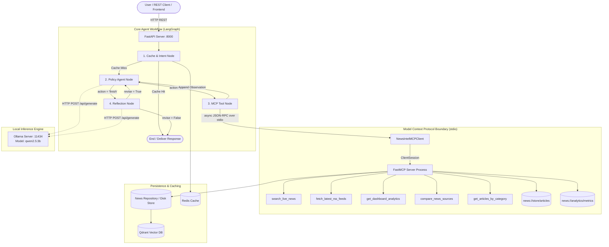
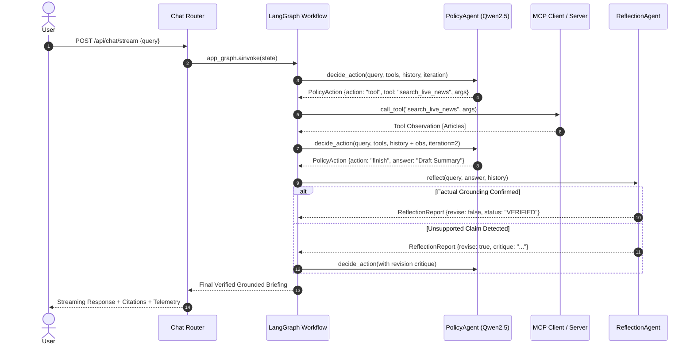

# Technical Reference Specification (TRS)
## NewsIntel AI — Multi-Agent Enterprise News Intelligence Platform

**Document Version:** 2.0.0  
**Status:** Approved / Active  
**Author:** DeepMind AI Pair Programming / Aishwarya Kyatham  
**Standard:** Level 2 Agent Technical Architecture & Protocol Specification  

---

### 1. System Architecture Overview

NewsIntel AI is engineered around a decoupled, protocol-first architecture combining **Model Context Protocol (MCP)** for secure tool execution, **LangGraph** for bounded state-machine orchestration, and **FastAPI** for service interfaces.



---

### 2. Model Context Protocol (MCP) Implementation

#### 2.1 Process Isolation & Stdio Transport
The FastMCP server (`backend/app/mcp_server.py`) runs in a separate dedicated subprocess managed by `NewsIntelMCPClient` (`backend/app/mcp_client.py`) using `mcp.StdioServerParameters` and `mcp.stdio_client`.

```python
server_params = StdioServerParameters(
    command=sys.executable,
    args=[server_script],
    env={"PYTHONPATH": backend_dir, ...}
)
async with stdio_client(server_params) as (read, write):
    async with ClientSession(read, write) as session:
        await session.initialize()
        # Full dynamic discovery & tool calls
```

#### 2.2 Tool Registry

| Tool Name | Parameters | Return Type | Description |
| :--- | :--- | :--- | :--- |
| `search_live_news` | `query: str`, `category: str`, `source: str`, `limit: int [1..50]` | `List[Dict]` | Searches indexed live news articles, location trends, or topic news. |
| `fetch_latest_rss_feeds` | *none* | `Dict[str, Any]` | Triggers live multi-source RSS ingestion and stores new unique articles. |
| `get_dashboard_analytics` | *none* | `Dict[str, Any]` | Returns global system stats, category breakdowns, and ingestion metrics. |
| `compare_news_sources` | `source1: str` (req), `source2: str` (req) | `Dict[str, Any]` | Compares editorial coverage, exclusive stories, and overlaps between outlets. |
| `get_articles_by_category` | `category: str`, `limit: int [1..50]` | `List[Dict]` | Retrieves live news filtered by exact domain category. |

#### 2.3 Resource Registry

| Resource URI | MIME Type | Access Method | Description |
| :--- | :--- | :--- | :--- |
| `news://store/articles` | `application/json` | `session.read_resource()` | Complete live indexed news article collection. |
| `news://analytics/metrics` | `application/json` | `session.read_resource()` | Source distribution, duplicate counts, and performance metrics. |

---

### 3. Agent State Machine & ReAcT Loop

#### 3.1 LangGraph State Schema (`AgentState`)
```python
class AgentState(TypedDict):
    user_id: str
    query: str
    intent: str
    cached_response: str
    retrieved_documents: List[Dict[str, Any]]
    specialized_output: str
    final_response: str
    error: str
    extracted_topic: str
    extracted_entities: List[str]
    expanded_query: str
    target_category: str
    target_url: str
    requested_limit: int
    observations: List[Dict[str, Any]]     # Stateful tool observation memory
    iteration_count: int                   # Bound counter (Max: 5)
    reflection_report: Dict[str, Any]      # Structured reflection report
    agent_trace: List[str]                 # Execution audit trail
    evaluation_metrics: Dict[str, Any]     # Live telemetry metrics
    next_action: str                       # 'tool' | 'finish' | 'policy'
    action_answer: str
    action_thought: str
    action_tool: str
    action_arguments: Dict[str, Any]
    start_time: float                      # Monotonic start timestamp
    cache_hit: bool
```

#### 3.2 Action Schema & Validation Lifecycle
The LLM output is validated through a 3-layer guardrail:
1. **JSON Extraction & Sanitation**: Strips markdown fences, parses raw JSON.
2. **Pydantic Model Validation**: Ensures `action in ["tool", "finish"]`, presence of required fields based on action type.
3. **MCP InputSchema Conformance**: Validates arguments against discovered server schemas (types, required parameters, range limits).



---

### 4. Evaluation Framework & Formulas

Evaluation metrics are computed dynamically over live runs and labeled ground-truth datasets (`app/data/eval_dataset.json`):

#### 4.1 Precision @ K
$$\text{Precision@}K = \frac{|\text{Retrieved Articles in Top } K \cap \text{Relevant Articles}|}{K}$$

#### 4.2 Mean Reciprocal Rank (MRR @ K)
$$\text{MRR@}K = \frac{1}{|Q|} \sum_{i=1}^{|Q|} \frac{1}{\text{rank}_i}$$
*(Where $\text{rank}_i$ is the rank position of the first relevant article).*

#### 4.3 Policy Routing Accuracy
$$\text{Routing Accuracy} = \frac{\sum_{q \in D} \mathbb{I}(\text{Selected Tool}_q == \text{Expected Tool}_q)}{|D|}$$
*(Un-clamped, un-floored exact tool match across labeled queries).*

#### 4.4 Lexical Faithfulness & Grounding
$$\text{Faithfulness} = \frac{|\text{Content Tokens in Answer} \cap \text{Tokens in Tool Observations}|}{|\text{Content Tokens in Answer}|}$$

---

### 5. Repository Hygiene & Coding Standards

1. **Isolation of Scratch Files**: All manual testing scripts, curl tests, and temporary scratch files must strictly be stored in `backend/scratch/`.
2. **Deterministic Offline Tests**: Unit and graph integration tests under `backend/tests/` must run fully offline without live Ollama or network dependencies.
3. **Timezone Standards**: All timestamps across logs, database stores, and JWT tokens must use timezone-aware UTC (`datetime.now(timezone.utc)`).
4. **Documentation Synchronization**: Any changes to MCP tools, graph state, or API endpoints require immediate updating of `docs/SRS.md`, `docs/TRS.md`, and `README.md`.
